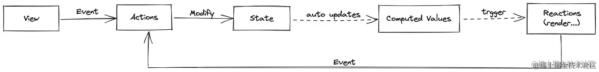

# 1,简介

在状态共享这方面，不像 `Vuex`，`React` 的官方并没有强力推荐某种封装方案，所以 `React` 的状态管理工具五花八门，百花齐放，
 
>  react-redux、dva、Context API、mobx、recoil/Jotai、zustand,valtio.

其中就有：

 -   做什么都要 `dispatch` 的 `redux` 流派，主打单向数据流，包括：`react-redux` 、`dva`、新星代表 `zustand`
 -   响应式流派 `mobx`。以及新星代表 `valtio` ，以及一个很有特点的库 `resso`
 -   原子状态流派。来自 `facebook` 开源的 `recoil` ，以及新星代表 `jotai`
 -   完全体 `hooks` 流派。`hox`、`reto`、`umijs@4 内置数据流`，包括 `Vue` 官方推荐的新状态管理工具 `pinia` 也是这个流派。


    
# 2，为什么会考虑写这篇文章

在公司的项目中使用的是 `dva.js` 作为 状态管理，但是`Dva.js`在编写代码时过于臃肿，并且 `dva.js` 仓库在 2019 年开始就不再维护了，不能及时跟上最新的技术发展。其在 `ts` 不再都没有任何提示的问题也逐步暴露。更不用说`dva.js`在错误处理方面极其不优雅，`dva.js` 在处理错误时，往往会导致整个应用崩溃，而不是只影响出错的部分。这使得我考虑有没有一种更加优雅的方式进行React状态的管理，并且能够完美兼容项目中已有的状态管理方法，作为一种补充手段为开发提效。

并且随着技术不断发展，我们终归是要摆脱繁琐的 `dva`，寻找一个新的状态管理工具，来减少我们这一块的代码量，对于这块技术的探索就提上了日程

> 具体改造可以参考我写的这篇文章 https://juejin.cn/post/7321049446443384870?searchId=2024051008370556AFD9AB416FDEE1C534

最终我选择了使用 zustand 作为我们新的状态管理工具引入项目，为什么会选择这个呢，文章的末尾会给我我考虑的理由

# 3，市面上React状态管理库介绍

在 Web 前端开发中，状态管理是一个非常重要的话题。随着 React 生态圈的不断壮大，越来越多的状态管理工具应运而生。其中主要分为这几个流派：


## 1. Redux 流派

> Redux 是最传统的状态管理库，强调单一数据源、不可变数据和纯函数更新。使用`dispatch`来触发action，通过reducers处理action并返回新的state。React-Redux提供了与React集成的桥梁。
> 
> Redux 的三大原则是：
> 
> -   单一数据源：整个应用的 state 被存储在一个 object tree 中，并且这个 object tree 只存在于唯一一个 store 中。
> -   State 是只读的：唯一改变 state 的方法就是触发 action，action 是一个用于描述已发生事件的普通对象。
> -   使用纯函数来执行修改：为了描述 action 如何改变 state tree ，你需要编写 reducers。
> 


在 React 生态圈中，有很多基于 Redux 思想的状态管理工具，
例如：

### react-redux：
React-Redux 是一个在 React 应用中使用 Redux 的官方绑定库。它提供了一种在 React 组件中连接 Redux store 的方法，使得组件能够获取 store 中的 state 并触发 actions。

简单实用介绍：

```js
npm install react-redux redux //安装依赖
```
#### store.js
```javascript
import { createStore } from 'redux';

// 定义初始状态
const initialState = { count: 0 };

// 定义根reducer，它决定了状态如何随着actions而变化
const rootReducer = (state = initialState, action) => {
  switch (action.type) {
    case 'INCREMENT':
      // 当action类型为INCREMENT时，增加count
      return { ...state, count: state.count + 1 };
    default:
      // 默认情况下不改变状态
      return state;
  }
};

// 使用createStore创建Redux store，并传入根reducer
export const store = createStore(rootReducer);
```

#### App.js
```javascript
import React from 'react';
import { Provider } from 'react-redux';
import store from './store';
import Counter from './Counter';

// React组件App使用Provider包裹，Provider是react-redux提供的组件，
// 它允许我们将Redux的store传递给组件树的任何部分
function App() {
  return (
    <Provider store={store}>
      <Counter />
    </Provider>
  );
}

export default App;
```

#### Counter.js
```javascript
import React from 'react';
import { connect } from 'react-redux';

// mapStateToProps是一个函数，它将Redux store中的状态映射到组件的props
const mapStateToProps = state => ({ count: state.count });

// mapDispatchToProps创建了一个对象，对象中的每个函数当你调用它们时，
// 都会通过dispatch派发一个action，这些函数也会作为props传递给组件
const mapDispatchToProps = dispatch => ({
  increment: () => dispatch({ type: 'INCREMENT' }),
});

// Counter是一个普通组件，它接收来自Redux store的count和increment作为props
function Counter({ count, increment }) {
  return (
    <div>
      <p>Count: {count}</p>
      {/* 当按钮被点击时，调用increment prop来dispatch一个INCREMENT action */}
      <button onClick={increment}>Increment</button>
    </div>
  );
}

// 使用connect高阶组件将Counter组件连接到Redux store
// connect函数接受两个参数：mapStateToProps和mapDispatchToProps
// 它返回一个新的组件，这个组件能够访问Redux store中的状态和分派actions
export default connect(mapStateToProps, mapDispatchToProps)(Counter);
```

这段代码演示了Redux最基础的使用方式：创建store、定义reducer、使用Provider将store提供给组件树、以及使用connect将组件连接到Redux store。通过这种方式，React组件能够获取全局状态并触发状态变更。
特点：

-   提供了 Provider 组件，用于将 Redux store 传递给 React 组件树。
-   提供了 connect 高阶组件，用于将 Redux store 中的 state 和 actions 映射到组件的 props。
-   基于 React 的 context API 实现，避免了不必要的组件重新渲染。

优点：

-   官方维护，社区支持度高，有很多相关资源。
-   高性能，避免了不必要的组件重新渲染。
-   支持中间件，可以方便地扩展 Redux 的功能。

缺点：

-   学习曲线较陡峭，需要熟悉 Redux 的概念。
-   代码冗余，需要编写很多样板代码。在大项目的时候简直是灾难，基本不会怎么考虑
-   需要手动管理 state 更新逻辑。安装依赖：


### dva：
受Redux启发，为中国开发者设计，提供简化版的API和模型（model）的概念，集成了Redux、Redux-Saga和React-Redux，使得状态管理更加简洁。
> 我认为 dva.js 更加适用于中小型的 React 项目，对于大型复杂的项目来说优点难受


首先，使用 `npm install dva` 安装 dva 依赖。

接下来，创建一个 Dva 应用（app.js）：

```javascript
// 导入 dva 核心库
import dva from 'dva';

// 初始化一个 dva 应用实例
const app = dva();

// 定义一个 model 来管理状态和逻辑，这里是计数器的模型
app.model({
  // 命名空间，用于区分不同模块的 action 和 reducer
  namespace: 'counter',

  // 初始状态
  state: 0,

  // reducers 负责处理同步操作，更新 state
  reducers: {
    increment(state) {
      // 返回新的 state，这里实现计数器加一的功能
      return state + 1;
    }
  }
});

// 导出 dva 应用实例
export default app;
```

在应用中使用创建的 Dva 应用（App.js）：

```javascript
// 引入 React 和 dva 的 connect 函数
import React from 'react';
import { connect } from 'dva';

// 引入初始化的 dva 应用实例
import app from './app';

// 定义 React 组件 Counter，展示计数器状态和提供增加按钮
function Counter({ count, dispatch }) {
  return (
    <div>
      <p>Count: {count}</p>
      {/* 点击按钮触发 action，通过 dispatch 方法 */}
      <button onClick={() => dispatch({ type: 'counter/increment' })}>
        Increment
      </button>
    </div>
  );
}

// 映射 state 到 Counter 组件的 props
const mapStateToProps = state => ({ count: state.counter });

// 使用 connect 函数将 Counter 组件与 Redux store 连接起来
const ConnectedCounter = connect(mapStateToProps)(Counter);

// 配置路由，指定根组件为 ConnectedCounter
app.router(() => <ConnectedCounter />);

// 启动 dva 应用，并挂载到页面的 #root 元素上
app.start('#root');
```

在这个示例中，我们创建了一个简单的计数器应用。首先创建一个名为 `counter` 的状态，并定义一个用于更新 `counter` 的方法 `increment`。然后在 `Counter` 组件中，我们使用 `connect` 函数将 `Counter` 组件与 Redux store 连接起来，通过点击按钮来增加计数器的值。

特点：

-   基于 Redux，继承了 Redux 的所有特性。
-   内置了 Redux-saga，简化了异步操作的处理。
-   提供了简洁的 API，减少了样板代码。
-   支持插件机制，可以方便地扩展功能。

优点：

-   简化了 Redux 和 Redux-saga 的使用，降低了学习成本。
-   内置了常用功能，提高了开发效率。
-   社区支持度较高，有很多相关资源。

缺点：
- 学习成本高：dva.js 基于多个库，需要预先理解这些库的概念。
- TypeScript 支持不足：缺乏类型提示，对 TypeScript 支持不完全。
- 更新慢：dva.js 更新和维护不积极，难以跟上技术发展。
- 错误处理不优雅：错误可能导致整个应用崩溃。
- 代码冗余：大量的模版代码，写起来挺累人的，使用redux toolkit可以一定程度的减少。
- 依赖多：依赖众多库，可能导致项目维护和升级复杂。不适合大型应用


### zustand：
Zustand 是一个轻量级的状态管理库，在近几年都是最火热的状态管理库，它提供了一种简单的方法来在 React 应用中管理全局状态。

简单实用：

首先，通过 `npm install zustand` 安装 Zustand 依赖。

接下来，创建一个 Zustand store：

```javascript
// store.js
import create from 'zustand';

// 使用 create 方法创建一个新的 Zustand store
const useStore = create(set => ({
  // 定义一个名为 count 的状态，初始值为 0
  count: 0,
  // 定义一个名为 increment 的方法，用于更新 count 状态
  increment: () => set(state => ({ count: state.count + 1 }))
}));

export default useStore;
```

在应用中使用创建的 Zustand store：

```javascript
// App.js
import React from 'react';
import useStore from './store';

function Counter() {
  // 从 useStore 中获取 count 状态和 increment 方法
  const { count, increment } = useStore();

  return (
    <div>
      {/* 渲染 count 状态 */}
      <p>Count: {count}</p>
      {/* 当点击按钮时，调用 increment 方法更新 count 状态 */}
      <button onClick={increment}>Increment</button>
    </div>
  );
}

function App() {
  return (
    <div>
      {/* 渲染 Counter 组件 */}
      <Counter />
    </div>
  );
}

export default App;
```

在这个示例中，我们创建了一个简单的计数器应用。首先创建一个名为 `count` 的状态，并定义一个用于更新 `count` 的方法 `increment`。然后在 `Counter` 组件中，我们使用 `useStore` 获取 `count` 状态和 `increment` 方法，通过点击按钮来增加计数器的值。

特点：

-   极简的 API，易于学习和使用。
-   不依赖于 Redux，避免了 Redux 的样板代码和复杂性。
-   支持异步操作，可以方便地处理异步状态更新。
-   小巧且高性能，避免了不必要的组件重新渲染。

优点：

-   简单易用，学习成本低。
-   代码简洁，减少了样板代码。
-   轻量级，适用于小型项目或者对性能要求较高的场景。

缺点：

- 社区支持：相较于 React-Redux 和 dva.js，zustand 的社区规模较小，相关资源较少。
- 状态管理：zustand 的轻量级和直接的状态管理方式可能不适合需要严格区分状态逻辑和界面逻辑的项目。
- 维护和发展：作为新兴库，zustand 的长期维护和发展方向相对不确定，有些开发者可能更倾向于选择有稳定记录的库。

## 2. 响应式流派

响应式编程是一种编程范式，它将应用状态和 UI 变更自动关联起来。当状态发生变化时，UI 会自动更新。在 React 生态圈中，有一些基于响应式编程思想的状态管理工具，例如：

### mobx：
一个非常灵活的状态管理库，它使用可观察对象（Observable）和自动更新（Autorun）机制来实现状态管理。

中文文档：https://suprise.github.io/mobx-cn/refguide/observable-decorator.html

MobX 是一个简单，可扩展的状态管理库，它通过透明的函数响应式编程 (Transparent Functional Reactive Programming, TFRP) 和面向对象编程 (Object Oriented Programming, OOP) 的方式，使状态管理变得简单和可扩展。

下面是一些基本的 MobX 用法：

首先，我们创建一个可观察的状态。MobX 可以将现有的数据结构（如对象、数组和类实例）转化为可观察的数据。这是通过 `observable` 函数实现的。

```javascript
import { observable } from 'mobx';

class TodoStore {
  // 使用 @observable 装饰器来标记 todos 属性为可观察的
  @observable todos = [];
  
  addTodo(todo) {
    this.todos.push(todo);
  }
}
```

接下来，我们定义一个动作。动作是改变状态的唯一途径。在 MobX 中，动作可以是任何修改状态的函数。使用 `action` 函数或装饰器来标记一个函数为动作。

```javascript
import { observable, action } from 'mobx';

class TodoStore {
  @observable todos = [];
  
  // 使用 @action 装饰器来标记 addTodo 为动作
  @action
  addTodo(todo) {
    this.todos.push(todo);
  }
}
```

然后，我们创建一个计算值。计算值是基于状态自动派生的值。它们可以是任何值，并且只有当它们的依赖项发生变化时才会重新计算。

```javascript
import { observable, computed } from 'mobx';

class TodoStore {
  @observable todos = [];
  
  addTodo(todo) {
    this.todos.push(todo);
  }

  // 使用 @computed 装饰器来创建一个计算值
  @computed get todoCount() {
    return this.todos.length;
  }
}
```

接着，我们定义一个反应。反应是当状态发生变化时自动运行的副作用（如 I/O 操作、DOM 操作）。MobX 提供了几种类型的反应，包括 `autorun`、`reaction` 和 `when`。

```javascript
import { observable, autorun } from 'mobx';

class TodoStore {
  @observable todos = [];
  
  addTodo(todo) {
    this.todos.push(todo);
  }
}

const store = new TodoStore();

// 使用 autorun 创建一个反应，当 todos 发生变化时自动运行
autorun(() => {
  console.log(store.todos.length);
});
```

最后，我们创建一个观察者组件。MobX 可以自动追踪观察者组件的渲染函数中使用的状态，并在状态发生变化时重新渲染组件。

```javascript
import React from 'react';
import { observer } from 'mobx-react';
import todoStore from './store';

// 使用 @observer 装饰器来标记 TodoListView 为观察者组件
@observer
class TodoListView extends React.Component {
  render() {
    return (
      <div>
        {todoStore.todos.map((todo, index) => 
          <div key={index}>{todo}</div>
        )}
        <button onClick={() => todoStore.addTodo('New Todo')}>
          Add Todo
        </button>
      </div>
    );
  }
}
```
mobx是一个非常典型的**响应式**状态管理工具。他的工作流程大致如下：

-   用户在view层触发某个事件
-   事件触发action执行，通过action来修改state
-   state更新后，computed Values也会根据依赖重新计算属性值
-   状态更新后会触发reactions，来响应这次状态变化的一些操作（重新渲染组件、打印日志...）



MobX 的出现给 Redux 带来了很大的冲击。

通过使用装饰器（observer / observable），可以使普通的组件监听变量变化并自动渲染，完全摒弃了 state。此外，MobX 还提供了诸如 computed 等功能，使得 React 也能享受到 Vue 组件的特性。因此，许多从 Vue 转到 React 的开发者都对 MobX 赞不绝口。一时之间，MobX 成为了炙手可热的技术。

然而，随着时间推移，MobX 的热度逐渐降低，原因如下：

1.  响应式 API 与 React 的设计理念不太契合。React 本身需要通过 setState 来修改状态，而 MobX 却可以直接修改 state.value。这使得刚学完 React 基础的新手在学习 MobX 时可能感到困惑。
1.  MobX 存在一些隐蔽的坑，例如在向 observable 添加属性时，不能直接添加，而需要通过 extendObservable。这导致许多开发者在使用过程中遇到问题。
1.  如果将 MobX 应用于基础组件，可能会违反高内聚原则。但如果不使用 MobX，又会导致代码风格不统一。很少有组件库需要附带一套状态管理工具。
1.  响应式实际上是基于 Proxy 实现的，有时会导致数据类型不符合预期。例如，开发者希望传递的是一个数组，但拿到的却是一个 Proxy，这可能让强迫症患者难以忍受。


特点：

1. 提供了丰富的 API 和概念，如可观察的数据、计算值、动作和反应等。
2. 支持异步操作，可以方便地处理异步状态更新。
3. 自动管理依赖关系，只更新需要更新的组件，避免不必要的重新渲染。

优点：

1. 简化状态管理，自动处理状态更新和依赖跟踪，减少了手动管理状态的复杂性。
2. 性能优化，只在需要时更新计算值和反应，避免了不必要的计算和渲染。
3. 易于集成，可以与多种前端框架（如 React、Vue 等）结合使用，提供了丰富的生态系统和工具。

缺点：

1. 学习成本相对较高，需要理解和掌握 MobX 的各种概念和原理。
2. 理念和 React 的设计理念不符合
3. 对 TypeScript 支持不是很友好。
4.  隐藏性：由于 MobX 的自动管理机制，有时候很难掌握状态的流动和反应的触发时机。
5.  不透明性：MobX 的内部实现较为复杂，如果需要深入理解和定制，可能会比较困难。
以上就是 MobX 的基本用法。更多细节和高级用法，请参考[官方文档](https://mobx.js.org/README.html)。
1. 风格自由。如果没有统一团队的代码风格，那你可能会在store中看到各种各样的代码。
### valtio：
Valtio 是一个简单、轻量级的状态管理库，它基于 JavaScript Proxy 对象实现。Valtio 的主要目标是提供一个简单易懂的 API，让你能够在 React 应用中轻松地创建和管理可变状态。

下面是一些基本的 Valtio 用法：

首先，我们创建一个代理状态。使用 `proxy` 函数创建一个代理状态。代理状态是一个可观察的对象，你可以像操作普通对象一样操作它。

```javascript
import { proxy } from 'valtio';

const todoStore = proxy({
  todos: [],
  addTodo: function (todo) {
    this.todos.push(todo);
  },
});
```

接下来，我们在 React 组件中使用代理状态。使用 `useProxy` React Hook 将代理状态与 React 组件关联。当代理状态发生变化时，组件将自动重新渲染。

```javascript
import React from 'react';
import { useProxy } from 'valtio';
import todoStore from './store';

function TodoListView() {
  // 使用 useProxy Hook 关联 todoStore
  const snapshot = useProxy(todoStore);

  return (
    <div>
      {snapshot.todos.map((todo, index) => (
        <div key={index}>{todo}</div>
      ))}
      <button onClick={() => todoStore.addTodo('New Todo')}>Add Todo</button>
    </div>
  );
}

export default TodoListView;
```

然后，我们创建一个派生状态。派生状态是根据代理状态自动计算得到的。使用 `derived` 函数创建派生状态。

```javascript
import { proxy, derived } from 'valtio';

const todoStore = proxy({
  todos: [],
  addTodo: function (todo) {
    this.todos.push(todo);
  },
});

// 使用 derived 函数创建派生状态
todoStore.todoCount = derived((state) => state.todos.length);
```

最后，我们在组件中使用派生状态。与代理状态一样，使用 `useProxy` Hook 在组件中关联派生状态。

```javascript
import React from 'react';
import { useProxy } from 'valtio';
import todoStore from './store';

function TodoListView() {
  const snapshot = useProxy(todoStore);

  return (
    <div>
      {snapshot.todos.map((todo, index) => (
        <div key={index}>{todo}</div>
      ))}
      <div>Todo Count: {snapshot.todoCount}</div>
      <button onClick={() => todoStore.addTodo('New Todo')}>Add Todo</button>
    </div>
  );
}

export default TodoListView;
```

Valtio 的特点和优缺点：

特点：

1.  简洁：Valtio 的 API 非常简洁，只需要了解几个函数和概念就可以开始使用。
1.  易用：Valtio 支持直接修改代理状态，无需使用特殊的函数或方法。
1.  轻量：Valtio 的代码量非常小，对项目的影响较小。

优点：

1.  易于理解：Valtio 的状态是普通的 JavaScript 对象，可以直接修改和访问，符合直觉。
1.  灵活：Valtio 支持多种数据类型和结构，可以灵活地组织和管理状态。

缺点：

1.  新兴：Valtio 是一个相对新的库，社区和生态可能不如一些成熟的状态管理库。
1.  兼容性：由于 Valtio 基于 Proxy，在不支持 Proxy 的环境（如 IE）中无法使用。


以上就是 Valtio 的基本用法。更多细节和高级用法，请参考 [GitHub 仓库](https://github.com/pmndrs/valtio)。

## 3. 原子状态流派

原子状态是一种将应用状态划分为多个独立、可组合的小状态的思想。这种做法有助于提高状态管理的灵活性和可维护性。在 React 生态圈中，有一些基于原子状态思想的状态管理工具，例如：

### recoil：
Recoil 是 Facebook 开发的一款实验性的状态管理库，专为 React 应用设计。它提供了一种简洁、高效的方式来管理组件间共享的状态。

> 设计的思路是将状态原子化。atom和selector是Recoil的两个核心。
> 
> atom：一个原子是一个共享状态的片段。
> 
> selector：一个组件可以订阅一个原子来获取/设置它的值。


Recoil 的使用：

1. 创建一个原子（Atom）

原子是 Recoil 中的基本状态单元。使用 `atom` 函数创建一个原子。

```javascript
import { atom } from 'recoil';

const todoListState = atom({
  key: 'todoListState', // 唯一标识符
  default: [], // 默认值
});
```

2. 在组件中读取和修改原子状态

使用 `useRecoilState` Hook 在组件中读取和修改原子状态。

```javascript
import React from 'react';
import { useRecoilState } from 'recoil';
import { todoListState } from './store';

function TodoListView() {
  const [todos, setTodos] = useRecoilState(todoListState);

  const addTodo = () => {
    setTodos([...todos, 'New Todo']);
  };

  return (
    <div>
      {todos.map((todo, index) => (
        <div key={index}>{todo}</div>
      ))}
      <button onClick={addTodo}>Add Todo</button>
    </div>
  );
}

export default TodoListView;
```

3. 创建一个选择器（Selector）

选择器是基于原子状态派生的状态。使用 `selector` 函数创建一个选择器。

```javascript
import { selector } from 'recoil';

const todoCountState = selector({
  key: 'todoCountState',
  get: ({ get }) => {
    const todos = get(todoListState);
    return todos.length;
  },
});
```

4. 在组件中使用选择器

使用 `useRecoilValue` Hook 在组件中读取选择器的值。

```javascript
import React from 'react';
import { useRecoilValue } from 'recoil';
import { todoCountState } from './store';

function TodoCount() {
  const todoCount = useRecoilValue(todoCountState);

  return <div>Todo Count: {todoCount}</div>;
}

export default TodoCount;
```

Recoil 的特点、优缺点：

特点：
1. 原子性：Recoil 将状态划分为原子和选择器，有助于更好地组织和管理状态。
2. 高效：Recoil 使用订阅机制，只有在状态发生变化时才会触发重新渲染。
3. 与 React 集成：Recoil 的 API 设计和 React Hooks 非常相似，可以与 React 无缝集成。

优点：
1. 易于上手：Recoil 的 API 与 React Hooks 非常相似，学习曲线较平缓。
2. 精细的更新控制：Recoil 只有在状态发生变化时才会触发组件重新渲染，提高了渲染性能。
3. 状态依赖管理：Recoil 的选择器可以自动处理状态依赖关系，简化了状态派生的管理。

缺点：
1. 实验性：Recoil 目前仍处于实验阶段，API 可能发生变化，生态和社区相对较小。
1. 不支持class组件。如果你是要更换项目的状态管理工具，应该看看原本项目中有没有用到class组件。
2. API比较多，上手稍微有点成本。
3. 消费一个状态比较繁琐，需要import两个东西

### jotai：
类似Recoil，更轻量级，专注于原子状态管理和响应式编程，强调简洁性和性能。
Jotai 的使用：

1. 创建一个原子（Atom）

原子是 Jotai 中的基本状态单元。使用 `atom` 函数创建一个原子。

```javascript
import { atom } from 'jotai';

const todoListAtom = atom([]); // 默认值
```

2. 在组件中读取和修改原子状态

使用 `useAtom` Hook 在组件中读取和修改原子状态。

```javascript
import React from 'react';
import { useAtom } from 'jotai';
import { todoListAtom } from './store';

function TodoListView() {
  const [todos, setTodos] = useAtom(todoListAtom);

  const addTodo = () => {
    setTodos([...todos, 'New Todo']);
  };

  return (
    <div>
      {todos.map((todo, index) => (
        <div key={index}>{todo}</div>
      ))}
      <button onClick={addTodo}>Add Todo</button>
    </div>
  );
}

export default TodoListView;
```

3. 创建一个派生原子（Derived Atom）

派生原子是基于其他原子状态派生的状态。使用 `atom` 函数创建一个派生原子。

```javascript
import { atom } from 'jotai';

const todoCountAtom = atom((get) => {
  const todos = get(todoListAtom);
  return todos.length;
});
```

4. 在组件中使用派生原子

与普通原子一样，使用 `useAtom` Hook 在组件中读取派生原子的值。

```javascript
import React from 'react';
import { useAtom } from 'jotai';
import { todoCountAtom } from './store';

function TodoCount() {
  const [todoCount] = useAtom(todoCountAtom);

  return <div>Todo Count: {todoCount}</div>;
}

export default TodoCount;
```

Jotai 的特点、优缺点：

特点：
1. 简洁：Jotai 的 API 非常简洁，只需要了解几个函数和概念就可以开始使用。
2. 原子性：Jotai 将状态划分为原子，有助于更好地组织和管理状态。
3. 轻量：Jotai 的代码量非常小，对项目的影响较小。

优点：
1. 易于上手：Jotai 的 API 简单直观，学习曲线平缓。
2. 精细的更新控制：Jotai 只有在状态发生变化时才会触发组件重新渲染，提高了渲染性能。
3. 状态依赖管理：Jotai 的派生原子可以自动处理状态依赖关系，简化了状态派生的管理。

缺点：
1. 新兴：Jotai 是一个相对新的库，社区和生态可能不如一些成熟的状态管理库。
2. 不适用于非 React 项目：Jotai 是专为 React 设计的，无法在非 React 项目中使用。

### 区别
Jotai 和 Recoil 都是为 React 设计的状态管理库，它们都采用了原子性的状态管理模型，但在具体的设计和实现上还是有一些区别的。

1. API 设计：

Recoil 的 API 设计更丰富一些，除了基本的原子和选择器，还提供了许多其他的 API，如原子族（atomFamily）、选择器族（selectorFamily）、异步选择器（asynchronous selectors）等，可以满足更复杂的状态管理需求。

而 Jotai 的 API 设计更简洁一些，只有原子和派生原子两种状态单元，API 数量较少，但也足够满足大部分的状态管理需求。

2. 状态更新：

Recoil 和 Jotai 在状态更新上的策略也有所不同。Recoil 采用了类似于 Redux 的不可变状态更新策略，每次更新都会返回一个新的状态。这种策略可以提供更好的时间旅行调试支持，但可能会带来一些性能开销。

而 Jotai 则采用了可变状态更新策略，每次更新可以直接修改状态。这种策略可以提供更快的更新性能，但可能会带来一些调试难度。

3. 社区和生态：

Recoil 是由 Facebook 开发并维护的，社区和生态相对更成熟一些。而 Jotai 则是由独立开发者开发和维护的，社区和生态相对较小。

总的来说，Recoil 和 Jotai 各有优势，选择哪一个主要取决于你的具体需求和喜好。如果你需要更丰富的 API 和更好的社区支持，可能会倾向于选择 Recoil；如果你需要更简洁的 API 和更快的更新性能，可能会倾向于选择 Jotai。
## 4. 完全体 hooks 流派

在 React Hooks 推出之后，许多开发者开始尝试使用 hooks 进行状态管理。这种做法使得状态管理更加简单和直观。在 React 生态圈中，有一些基于 hooks 的状态管理工具，例如：

### hox：
Hox 是一个基于 React Hooks 的状态管理库，它提供了一种简单、轻量级的方式来管理组件间共享的状态。

Hox 的使用：

1. 创建一个自定义 Hook

在 Hox 中，状态管理是通过自定义 Hook 实现的。首先创建一个自定义 Hook。

```javascript
import { useState } from 'react';

function useTodoList() {
  const [todos, setTodos] = useState([]);

  const addTodo = (todo) => {
    setTodos([...todos, todo]);
  };

  return { todos, addTodo };
}

export default useTodoList;
```

2. 使用 `createModel` 创建模型

将自定义 Hook 传递给 `createModel` 函数，创建一个模型。

```javascript
import { createModel } from 'hox';
import useTodoList from './useTodoList';

const todoListModel = createModel(useTodoList);
```

3. 在组件中使用模型

使用 `useModel` Hook 在组件中读取和修改模型的状态。

```javascript
import React from 'react';
import { useModel } from 'hox';
import todoListModel from './todoListModel';

function TodoListView() {
  const { todos, addTodo } = useModel(todoListModel);

  return (
    <div>
      {todos.map((todo, index) => (
        <div key={index}>{todo}</div>
      ))}
      <button onClick={() => addTodo('New Todo')}>Add Todo</button>
    </div>
  );
}

export default TodoListView;
```

Hox 的特点、优缺点：

特点：
1. 基于 React Hooks：Hox 的状态管理是基于 React Hooks 的，与 React 的编程模型高度一致。
2. 简洁：Hox 的 API 非常简洁，只需要了解几个函数和概念就可以开始使用。
3. 轻量：Hox 的代码量非常小，对项目的影响较小。

优点：
1. 易于上手：Hox 的 API 简单直观，学习曲线平缓。
2. 与 React 集成：Hox 的 API 设计和 React Hooks 非常相似，可以与 React 无缝集成。
3. 状态共享：Hox 支持跨组件共享状态，可以轻松地管理全局状态。

缺点：
1. 社区和生态：相较于一些成熟的状态管理库（如 Redux、MobX），Hox 的社区和生态相对较小。
2. 不适用于非 React 项目：Hox 是专为 React 设计的，无法在非 React 项目中使用。
### reto：
一个基于 hooks 的模块化状态管理库，提供了一种类似于 Redux 的状态管理方式。

Reto 是一个基于 React Hooks 的状态管理库，它的核心理念是将状态管理和 React 组件的生命周期紧密结合在一起。

Reto 的使用：

1. 创建一个 Store

在 Reto 中，状态管理是通过 Store 实现的。首先创建一个 Store，这是一个继承了 Reto 的 Store 类的类。

```javascript
import { Store } from 'reto';

class TodoStore extends Store {
  state = {
    todos: [],
  };

  addTodo = (todo) => {
    this.setState({ todos: [...this.state.todos, todo] });
  };
}

export default TodoStore;
```

2. 在组件树中提供 Store

使用 `Provider` 组件在组件树中提供 Store。

```javascript
import React from 'react';
import { Provider } from 'reto';
import TodoStore from './TodoStore';
import TodoListView from './TodoListView';

function App() {
  return (
    <Provider of={TodoStore}>
      <TodoListView />
    </Provider>
  );
}

export default App;
```

3. 在组件中使用 Store

使用 `useStore` Hook 在组件中读取和修改 Store 的状态。

```javascript
import React from 'react';
import { useStore } from 'reto';
import TodoStore from './TodoStore';

function TodoListView() {
  const todoStore = useStore(TodoStore);

  return (
    <div>
      {todoStore.state.todos.map((todo, index) => (
        <div key={index}>{todo}</div>
      ))}
      <button onClick={() => todoStore.addTodo('New Todo')}>Add Todo</button>
    </div>
  );
}

export default TodoListView;
```

Reto 的特点、优缺点：

特点：
1. 基于 React Hooks：Reto 的状态管理是基于 React Hooks 的，与 React 的编程模型高度一致。
2. 简洁：Reto 的 API 非常简洁，只需要了解几个函数和概念就可以开始使用。
3. 轻量：Reto 的代码量非常小，对项目的影响较小。

优点：
1. 易于上手：Reto 的 API 简单直观，学习曲线平缓。
2. 与 React 集成：Reto 的 API 设计和 React Hooks 非常相似，可以与 React 无缝集成。
3. 状态共享：Reto 支持跨组件共享状态，可以轻松地管理全局状态。

缺点：
1. 社区和生态：相较于一些成熟的状态管理库（如 Redux、MobX），Reto 的社区和生态相对较小。
2. 不适用于非 React 项目：Reto 是专为 React 设计的，无法在非 React 项目中使用。


### umijs@4 内置数据流：
`umijs@4.x` 正式推出后，我注意到它内置了一套和 `hox` 一模一样的[数据流方案](https://umijs.org/docs/max/data-flow)。我大概翻了一下，虽然它不是直接引用的 `hox` ，但内部实现逻辑如出一辙。

它的特点是，采用`约定式`目录结构，不用专门写 `createStore` ，而是自动帮我们引入了所有 `model` 目录下的 `hooks`，并注册。在页面中则是通过统一的 `useModel`，通过其自动生成的 `namespace` 引用，比如 `useModel('product')`。但这也导致了依赖不明确的问题，`umi4` 还特地通过编写[插件](https://umijs.org/docs/max/data-flow#%E4%BD%BF%E7%94%A8-model)的方式解决跳转问题。

但也正是它的约定式，产生了一些让我觉得膈应的地方：

1.  `useModel('product')` 必须要通过装插件才能点击跳转。
1.  必须要在 `umijs@4.x` 体系下才能使用，无法快速复制迁移到其它的框架下使用。
1.  插件偷偷帮你实现了 `createStore`，乍一看和普通的 `hooks` 完全一样，其实已经持久化了。对新人学习很不友好。（你写个 `createStore` 他还知道有不一样的地方，回去查。`umijs@4.x` 没看到文档根本不知道有这回事）

UmiJS 是一个可扩展的企业级前端应用框架，它内置了一套简单的数据流方案，基于 React Hooks 实现。UmiJS 4 版本的内置数据流方案称为 "dumi"。

UmiJS 内置数据流的使用：

1. 创建一个 Model

在 UmiJS 中，状态管理是通过 Model 实现的。首先创建一个 Model 文件。

```javascript
// src/models/todo.js
import { useState } from 'react';

export default function useTodoModel() {
  const [todos, setTodos] = useState([]);

  const addTodo = (todo) => {
    setTodos([...todos, todo]);
  };

  return { todos, addTodo };
}
```

2. 在 `.umirc.ts` 或 `config/config.ts` 文件中配置 Model

将创建的 Model 添加到配置文件中。

```javascript
// .umirc.ts 或 config/config.ts
export default {
  // ...
  plugins: [
    // ...
    ['@umijs/plugin-model', {}],
  ],
  // ...
};
```

3. 在组件中使用 Model

使用 `useModel` Hook 在组件中读取和修改 Model 的状态。

```javascript
import React from 'react';
import { useModel } from 'umi';

function TodoListView() {
  const { todos, addTodo } = useModel('todo');

  return (
    <div>
      {todos.map((todo, index) => (
        <div key={index}>{todo}</div>
      ))}
      <button onClick={() => addTodo('New Todo')}>Add Todo</button>
    </div>
  );
}

export default TodoListView;
```

UmiJS 内置数据流的特点、优缺点：

特点：
1. 基于 React Hooks：UmiJS 内置数据流是基于 React Hooks 的，与 React 的编程模型高度一致。
2. 简洁：UmiJS 内置数据流的 API 非常简洁，只需要了解几个函数和概念就可以开始使用。
3. 轻量：UmiJS 内置数据流的代码量非常小，对项目的影响较小。

优点：
1. 易于上手：UmiJS 内置数据流的 API 简单直观，学习曲线平缓。
2. 与 UmiJS 集成：UmiJS 内置数据流的 API 设计和 UmiJS 框架高度集成，可以无缝使用。
3. 状态共享：UmiJS 内置数据流支持跨组件共享状态，可以轻松地管理全局状态。

缺点：
1. 社区和生态：相较于一些成熟的状态管理库（如 Redux、MobX），UmiJS 内置数据流的社区和生态相对较小。
2. 不适用于非 UmiJS 项目：UmiJS 内置数据流是专为 UmiJS 设计的，无法在非 UmiJS 项目中使用。
### pinia：

虽然是Vue的状态管理库，但因其理念与React的一些现代状态管理库相似，故在此提及。它强调简洁、类型安全，通过Stores来组织状态。
# 总结

React 的状态管理工具五花八门，百花齐放，各种工具都有其特点和适用场景。开发者在选择状态管理工具时，需要根据项目需求和团队技术栈进行权衡。同时，随着 React 生态圈的不断发展，未来可能还会出现更多新的状态管理工具。

选择合适的React状态管理流派，主要取决于以下几个关键因素：

1. **项目规模和复杂度**：
   - 对于小型项目或者快速原型开发，轻量级的状态管理方案更为合适，如**Zustand**、**Jotai**、**Context API**，因为它们的学习曲线较低，设置简单，能够快速开始。
   - 对于中大型项目，尤其是那些需要严格控制状态变更流程、有复杂数据交互和需要时间旅行调试功能的，**Redux**及其生态（如**Redux Toolkit**）、**MobX**可能是更好的选择，因为它们提供了强大的状态管理机制和丰富的生态系统支持。

2. **团队熟悉度**：
   - 如果团队成员对某个库已经有深入理解和使用经验（比如之前项目用过**Redux**），继续沿用可以减少学习成本和提升开发效率。
   - 若团队偏好现代React Hooks风格编程，那么**Recoil**、**Jotai**或**Valtio**这类基于Hooks的库可能更受欢迎，因为它们更贴近React最新的编程模式。

3. **性能和可维护性**：
   - 对于性能敏感的应用，考虑使用像**Valtio**这样利用Proxy实现的轻量级响应式状态库，或**Zustand**这样设计高效的状态管理器。
   - 可维护性方面，清晰的数据流向和易于理解的架构很关键。**Redux**通过严格的action-reducer模式保证了这一点，而**MobX**的自动追踪机制减少了手动管理状态的复杂度。

4. **未来发展趋势和技术栈整合**：
   - 关注社区活跃度、库的维护情况以及是否与你的其他技术栈（如TypeScript、Next.js等）有良好的集成。
   - 新兴的库如**Resso**、**Hox**、**Reto**等，如果它们提供的特性和你的项目需求高度匹配，且社区反馈积极，也可以考虑采用，但需注意评估其成熟度和长期支持的可能性。

5. **个人或团队偏好**：
   - 开发者的个人喜好和团队的编程哲学也很重要。一些团队可能偏好声明式编程（如**MobX**），而另一些可能更倾向于函数式编程风格（如**Redux**）。

最终，建议是先进行小规模的PoC（Proof of Concept）测试，用实际代码尝试几种不同的状态管理方案，看哪一种最符合项目需求、团队协作习惯和预期的开发效率。同时，保持灵活性，随着项目的发展，状态管理策略也可以适时调整。

# 综合比较

特性/库       | react-redux | dva       | zustand         | mobx       | valtio           | recoil           | jotai        |
| ---------- | ----------- | --------- | --------------- | ---------- | ---------------- | ---------------- | ------------ |
| **基于**     | Redux       | Redux     | 独立              | 响应式        | Proxy            | 独立               | 独立           |
| **性能**     | 中等          | 中等        | 高               | 高          | 高                | 高                | 高            |
| **学习曲线**   | 陡峭          | 较陡        | 适中              | 适中         | 适中               | 适中               | 适中           |
| **API复杂度** | 高           | 中等        | 低               | 低          | 低                | 中等               | 低            |
| **类型安全**   | 适中          | 适中        | 优秀              | 适中         | 适中               | 适中               | 适中           |
| **异步处理**   | 需要中间件       | 内置        | 内置              | 内置         | 内置               | 内置               | 内置           |
| **状态共享**   | Context     | 内置        | 无需Provider      | 响应式        | 无需Provider       | 需要Recoil Context | 无需Provider   |
| **状态更新**   | 不变更新        | 不变更新      | 不变更新            | 响应式更新      | 响应式更新            | 不变更新             | 响应式更新        |
| **生态工具**   | 丰富          | 差，已经不再维护        | 丰富，比较火热，社区生态逐渐丰富              | 适中         | 适中               | 新兴，生态欠佳               | 新兴，生态欠佳           |
| **特点**     | 官方Redux绑定   | 简化版Redux  | 轻量、Hooks        | 响应式核心      | 轻量、Proxy         | 原子化状态            | 轻量、原子化状态     |
| **优势**     | 官方维护，社区资源丰富 | 简化Redux使用 | **轻量、易于上手、高性能** | 响应式编程，自动追踪 | 由Facebook开发，社区支持 | 轻量级，易于理解和使用      |              |
| **使用场景**   | 大型应用        | 中小型应用     | 各种规模应用          | 需要响应式特性的应用 | 需要细粒度状态控制的应用     | 需要复杂状态管理的应用      | 需要轻量级状态管理的应用

# PS：为什么不选

1.  **React-Redux / dva.js**：尽管这些工具在状态管理方面非常成熟，但它们在大型项目中的代码冗余和复杂性较高，且整体框架相对笨重，这可能影响开发效率和项目的可维护性。


3.  **MobX / Valtio**：这些库采用了响应式编程范式，与 React 的声明式特性存在一定差异。团队成员对响应式状态管理不太熟悉，这可能增加学习成本，不利于快速推广和应用。


5.  **Recoil / Jotai**：虽然这两个库在概念上相似，提供了基于原子和选择器的状态管理方式，但 Recoil 的 `selector` 功能相对复杂，存在一定的上手难度。此外，它们的生态系统相比其他成熟的解决方案还不够丰富，许多功能仍在实验阶段，可能不太适合用于对稳定性要求较高的大型企业项目。

> 细心点你会发现，zustand / valtio / jotai 是同一个开源团队的作品，而且他们的名字分别是 德语、芬兰语、日语 中的“状态”。所以，不选择某个工具，不是说这些工具不好，他们之间并没有孰优孰劣，只是面向风格不一样罢了。


# 我是如何选的

在综合评估了项目需求和团队技术栈后，我们决定采用 `Zustand` 作为团队项目状态管理的改造工具。以下是我们选择 `Zustand` 的主要理由：

1. **学习曲线平缓**：`Zustand` 遵循单向数据流原则，与 `dva.js` 和 Redux 类似，但提供了更简洁的学习路径，便于团队快速掌握和推广。

2. **轻量级设计**：`Zustand` 的体积极为小巧，gzip 压缩后仅有 1KB，对项目性能的影响微乎其微。

3. **与 React 高度集成**：通过利用 React 的钩子（Hooks）机制，`Zustand` 提供了与函数式组件和钩子编程模型无缝衔接的状态管理方式，API 设计简洁，易于上手。

4. **灵活的集成能力**：`Zustand` 能够轻松与其他 React 状态管理库如 Redux 和 MobX 共存，为项目提供了渐进式迁移的可能性。

5. **TypeScript 友好**：与 `dva.js` 等其他状态管理库相比，`Zustand` 对 TypeScript 提供了更优的支持，有助于提升代码质量和开发体验。

6. **强大的可扩展性**：通过中间件机制，`Zustand` 允许开发者以插件形式扩展其功能，包括日志记录、状态持久化、异步操作处理等，增加了状态管理的灵活性。

7. **性能优化**：`Zustand` 在设计上注重性能，采用高效的更新机制减少不必要的渲染，同时支持状态分片和惰性初始化，有效提升了大型应用的性能。

8. **活跃的社区生态**：作为近年来备受瞩目的状态管理库，`Zustand` 拥有一个活跃的开发者社区，为遇到的问题提供了丰富的解决方案和高效的支持。

通过实际改造，我们已实现代码量的显著减少（约 33%），并显著提升了代码的组织逻辑和开发效率。


改造文章：

1，# Zustand 状态库：轻便、简洁、强大的 React 状态管理工具https://juejin.cn/post/7321049446443384870#heading-3


2，我写的一个zustand npm工具：zustand-cli
https://www.npmjs.com/package/zustand-cli